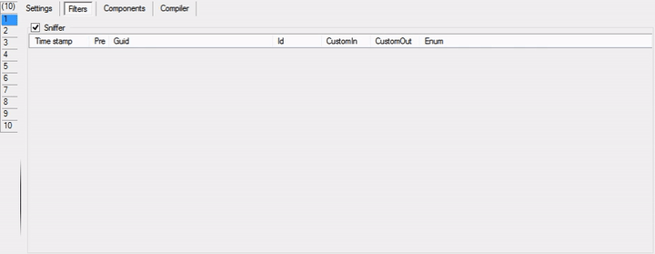

# CommandEvent (DTE)

This can be used for catching all Command Events from your VS IDE.

Also available Sniffer as helper for listening all commands from EnvDTE:



Find and add all what you want, configure it after, then use with [available modes](../Modes).

## Get the last command

You can use [DTEComponent](../Scripts_&_Commands/SBE-Scripts/Components/DTEComponent) of [SBE-Scripts](../Scripts_&_Commands/SBE-Scripts) core.

Samples:

```
#!java

$(lcGuid = #[DTE events.LastCommand.Guid])
$(lcId   = #[DTE events.LastCommand.Id])

#[($(lcGuid) == "{1496A755-94DE-11D0-8C3F-00C04FC2AAE2}" && $(lcId) == 1627) {
    #[File scall("notepad", "#[var log]", 30)]
}]
```

or you can use [C# Mode](../Modes/CSharp) etc.

# References

* [Available Events](../Events)
* [Processing modes](../Modes)
* [Examples & Features](../Examples)