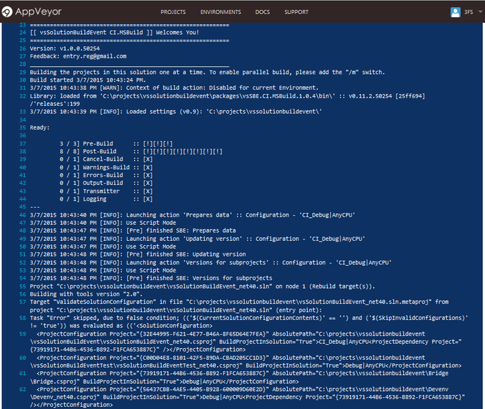

# Continuous Integration (CI)

Starting with v0.11, vsSolutionBuildEvent can be used for [continuous Integration](http://en.wikipedia.org/wiki/Continuous_integration) with others tools...

It's possible with next additional utilities:

* [CI.MSBuild](../CI/CI.MSBuild/) - for work through msbuild.exe
* [Devenv Command-Line](../CI/Devenv Command-Line/) - for work through devenv of the Visual Studio
