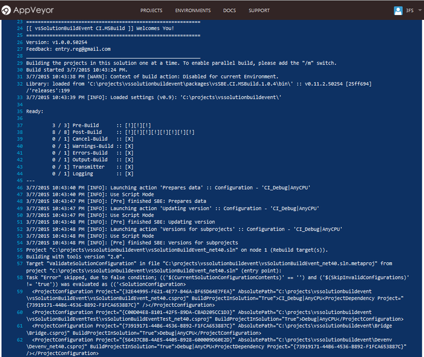




# vsSolutionBuildEvent CI.MSBuild

Module for work with [vsSolutionBuildEvent](https://visualstudiogallery.msdn.microsoft.com/0d1dbfd7-ed8a-40af-ae39-281bfeca2334/) through **[Microsoft Build Tools](https://msdn.microsoft.com/en-us/library/vstudio/ms164311.aspx)**

## How to get & Install







### NuGet packages

Modern versions: [](https://www.nuget.org/packages/vsSolutionBuildEvent/)

Legacy versions: [](https://www.nuget.org/packages/vsSBE.CI.MSBuild/)

You can easily get package using lightweight script tool [GetNuTool](https://github.com/3F/GetNuTool) *~10 Kb*

```{{site.msblang}}
gnt /p:ngpackages="vsSolutionBuildEvent/{{site.lnkCur_VSPackage[0]}}"
```

```{{site.msblang}}
msbuild gnt.core /p:ngpackages="vsSolutionBuildEvent/{{site.lnkCur_VSPackage[0]}}"
```

## How to use

Basic activation through [cim.cmd](https://github.com/3F/vsSolutionBuildEvent/blob/master/CI.MSBuild/cim.cmd) helper (distributed with modern versions):

```{{site.msblang}}
packages\vsSolutionBuildEvent\cim.cmd
```

for example:

```{{site.msblang}}
set cim=packages\vsSolutionBuildEvent\cim.cmd -vsw-priority "Microsoft.VisualStudio.Component.VC.Redist.14.Latest"
...
call %cim% "regXwild.sln" /v:m /m:4 /p:Configuration="%reltype%" /p:Platform=%platform%
```

Before 1.14, *CI.MSBuild.bat:*

```bash
<fullpath_to>\CI.MSBuild" <SolutionFile.sln> <optional_keys>
```
```bash
> bin\CI.MSBuild ConsoleApplication1.sln
```

Custom activation manually:

```{{site.msblang}}
msbuild.exe "<SolutionFile>.sln" /l:"<fullpath_to>\CI.MSBuild.dll"
```

Optionally you can set custom path to library using [`lib=<path>`](#keys-to-ci-msbuild) key such as
```{{site.msblang}}
/l:"<path_to>\CI.MSBuild.dll";lib=<path_to_directory>
```

eg: 
```{{site.msblang}}
`/l:"D:\CI\CI.MSBuild.dll";lib=D:\lib\`
```

Use `/verbosity` key to manage detailed information from the main library. To activate debug mode, *detailed* or *diagnostic*:

```{{site.msblang}}
msbuild.exe "<SolutionFile>.sln" /v:detailed /m:4 /l:"<path_to>\CI.MSBuild.dll" /nologo /noconlog
```

For modern versions you can define `__vssbe_diag` variable to enable diagnostic mode:

```batch
set __vssbe_diag=true
```


### Keys to CI.MSBuild

name     | description                                                                                                                                         | sample
---------|-----------------------------------------------------------------------------------------------------------------------------------------------------|-------
lib      |Path to main library - vsSolutionBuildEvent.dll                                                                                                      |/l:"CI.MSBuild.dll";lib=D:\bin\
culture  |v1.3+ Culture for the current thread                                                                                                                 |culture=ru-RU
cultureUI|v1.3+ Culture used by the Resource Manager to look up culture-specific resources at run time. For example - console messages from msbuild engine etc.|cultureUI=en-US

Samples: 

* `"D:\projects\App1.sln" /l:"CI.MSBuild.dll";lib=D:\bin\vsSolutionBuildEvent\;cultureUI=en-US /v:detailed /t:Rebuild /p:Configuration=Debug;Platform="Any CPU" /m:8`

Note for the culture keys: You can also active console code page with [`chcp [nnn]` command](https://technet.microsoft.com/en-us/library/bb490874.aspx):

* United States: `chcp 437`
* Russian: `chcp 866` (oem dos)

If you want disable all msbuild-messages (i.e. allow messages only from vsSolutionBuildEvent), use `/noconsolelogger` [key to msbuild.exe](https://msdn.microsoft.com/en-us/library/vstudio/ms164311.aspx).
The levels of messages from library are managed by [.vssbe.user](../../Features/.vssbe/#vssbe-user) file.

### Additional MSBuild Properties

List of properties that available as the MSBuild Properties (e.g. `$(name)`)

name                 | description                                   | sample of value  | availability
---------------------|-----------------------------------------------|------------------|-----
vsSolutionBuildEvent |The version of the vsSolutionBuildEvent engine.| 0.12.6.19789     | v1.6+
vssbeCIM             |The version of the CI.MSBuild                  | 1.5.0.19789      | v1.6+

### Keys to msbuild.exe

Use `msbuild.exe /?` to look all available keys or see [MSDN documentation](https://msdn.microsoft.com/en-us/library/vstudio/ms164311.aspx)

name      | description | sample
----------|-------------|-------
/noconlog |To disable all msbuild-messages. Is a short form of `/noconsolelogger`.                                                                                                                                       | /noconlog
/v:level  |Information to display in the build log. Levels: `q[uiet]`, `m[inimal]`, `n[ormal]`. Starting with `d[etailed]` and `diag[nostic]` is also turns on the **debug mode** for vsSolutionBuildEvent.| /v:diag
/m[:num]  |The maximum number of concurrent processes to use when building.                                                                                                                                | /m:16

### Could not load file or assembly ... or one of its dependencies.

```{{site.msblang}}
MSBUILD : error MSB4017: The build stopped unexpectedly because of an unexpected logger failure.
...
```

[Our NuGet Package](https://www.nuget.org/packages/vsSolutionBuildEvent/) **already** contains most required libraries for working.

However various environments for CI has a different configuration and if you see similar problem and list of this:
 
 `Could not load file or assembly ... or one of its dependencies.`
 
You can try add this manually into **/bin** folder.

If you see any problem with installing and/or using, please report [here]({{site.issueNew}})

*Some references can be removed later special for CI.MSBuild version and/or some libraries can be added later in [our package](https://www.nuget.org/packages/vsSolutionBuildEvent/) directly or as dependencies to full automation.*

## Version number in path for remote NuGet packages

```
packages\vsSolutionBuildEvent.{{site.lnkCur_VSPackage[0]}}\tools\
.............................^^^^^
```

For [GetNuTool](https://github.com/3F/GetNuTool)

* Configure `output` key. Example for [packages.config](https://github.com/3F/regXwild/blob/master/packages.config)

(Legacy) For nuget clients

* Use **[-ExcludeVersion](https://docs.nuget.org/consume/command-line-reference)** key, e.g.: `vsSBE.CI.MSBuild\bin\CI.MSBuild.dll`

### Example for AppVeyor

[https://github.com/3F/regXwild](https://github.com/3F/regXwild)

[/builds/34562551](https://ci.appveyor.com/project/3Fs/regxwild-github/builds/34562551)
[](https://ci.appveyor.com/project/3Fs/regxwild-github/builds/34562551)

### Example for TeamCity

Similar to AppVeyor above.


# References

* [vsSolutionBuildEvent Devenv](../Devenv Command-Line/)
* [Scripts & Commands](../../Scripts/)
* [GetNuTool](https://github.com/3F/GetNuTool)
* [Examples](../../Examples)