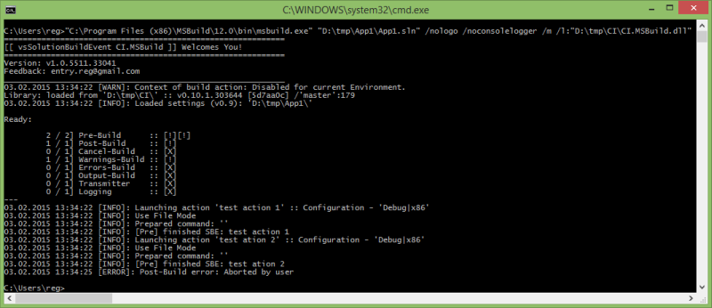

# vsSolutionBuildEvent CI.MSBuild

Utility to support the [CI / Special Build servers](http://en.wikipedia.org/wiki/Continuous_integration) for work with [vsSolutionBuildEvent](https://visualstudiogallery.msdn.microsoft.com/0d1dbfd7-ed8a-40af-ae39-281bfeca2334/) through **[msbuild.exe](https://msdn.microsoft.com/en-us/library/vstudio/ms164311.aspx)** (Microsoft Build Tools)

*see [Devenv Command-Line](../Devenv Command-Line/) if you're searching work in command-line mode of Visual Studio(devenv.exe /.com)*

## How to get & Install

Currently the CI.MSBuild it's only additional wrapper (~50 kb) for work with vsSolutionBuildEvent plugin through [API](../../API/). *You should also have this library for work it means.*

**However**, [variant with NuGet](https://www.nuget.org/packages/vsSBE.CI.MSBuild/) also provides main libraries for work. Use any convenient variant for you!

### Variant with NuGet

[](https://www.nuget.org/packages/vsSBE.CI.MSBuild/)

[vsSBE.CI.MSBuild](https://www.nuget.org/packages/vsSBE.CI.MSBuild/) - Full version(with all main libraries), just get and use...

`nuget install vsSBE.CI.MSBuild`

for example: `nuget install vsSBE.CI.MSBuild -ExcludeVersion -OutputDirectory C:\projectX\bin\`

**OR**

Add this utility for your **.sln** (see [Managing Packages for the Solution](https://docs.nuget.org/consume/package-manager-dialog#managing-packages-for-the-solution)):

* In Visual Studio: right click on solution -> `Manage NuGet Packages for Solution...`

That's all. Now you can use vsSolutionBuildEvent with msbuild.

### Custom variant

*For advanced usage, for example with own NuGet private server, custom libraries etc.*

* Download [CI.MSBuild_v1.5_[8bde22a][net40].zip](http://sourceforge.net/projects/vssbe/files/CI-Utilities/CI.MSBuild/CI.MSBuild_v1.5_%5B8bde22a%5D%5Bnet40%5D.zip/download) (SourceForge.net) 
    * All binaries of the CI.MSBuild: [CI-Utilities/CI.MSBuild/](https://sourceforge.net/projects/vssbe/files/CI-Utilities/CI.MSBuild/)
* Unpack the CI.MSBuild archive. *(you can delete all .pdb files)*
* Download the [vsSolutionBuildEvent plugin](http://visualstudiogallery.msdn.microsoft.com/0d1dbfd7-ed8a-40af-ae39-281bfeca2334/referral/118151) and extract all files from .**vsix** with any archiver ([it's a simple 'zip' archive](https://msdn.microsoft.com/en-us/library/ff407026.aspx))
    * **Or** simply go to the installed folder (In plugin: `Settings` - `CI Utilities` - `Plugin` - `Open directory with plugin`)
* Combine all this files in one folder. **Or** use [`lib=<path>`](#keys-to-ci-msbuild) key to CI.MSBuild.dll library.

That's all. Now you can use vsSolutionBuildEvent with msbuild.

## How to use

After an installation you can use the vsSolutionBuildEvent with [msbuild.exe](https://msdn.microsoft.com/en-us/library/vstudio/ms164311.aspx), for example:


```bash 

"C:\Program Files (x86)\MSBuild\12.0\bin\msbuild.exe" "<SolutionFile>.sln" /l:"<fullpath_to>\CI.MSBuild.dll"
```
Also you can set other path to library with [`lib`](#keys-to-ci-msbuild) key as: `/l:"<fullpath_to>\CI.MSBuild.dll";lib=<full_path_directory>`, for example: `/l:"D:\CI\CI.MSBuild.dll";lib=D:\lib\`

You can also use the `/verbosity` key for details information from vsSolutionBuildEvent - `/verbosity:detailed` or `/verbosity:diagnostic` (**debug mode** for vsSolutionBuildEvent), for example:

```bash 

"C:\Program Files (x86)\MSBuild\12.0\bin\msbuild.exe" "<SolutionFile>.sln" /nologo /noconsolelogger /verbosity:detailed /m:4 /l:"<fullpath_to>\CI.MSBuild.dll"
```

Use the command: `msbuild.exe /?` for details about keys: `/nologo` `/noconsolelogger` `/m` or see [MSDN documentation](https://msdn.microsoft.com/en-us/library/vstudio/ms164311.aspx)




### Keys to CI.MSBuild

name | description | sample
-----|-------------|-------
lib  |Path to main library - vsSolutionBuildEvent.dll|/l:"CI.MSBuild.dll";lib=D:\bin\
culture|v1.3+ Culture for the current thread|culture=ru-RU
cultureUI|v1.3+ Culture used by the Resource Manager to look up culture-specific resources at run time. For example - console messages from msbuild engine etc.|cultureUI=en-US


Samples: 

* `"D:\projects\App1.sln" /nologo /l:"CI.MSBuild.dll";lib=D:\bin\vsSolutionBuildEvent\;cultureUI=en-US /verbosity:detailed /t:Rebuild /p:Configuration=Debug;Platform="Any CPU" /m:8`

If you want disable all msbuild messages, i.e. allow only messages from vsSolutionBuildEvent, use the `/noconsolelogger` key to msbuild [[?](https://msdn.microsoft.com/en-us/library/vstudio/ms164311.aspx)]


### Could not load file or assembly ... or one of its dependencies.

```bash 

MSBUILD : error MSB4017: The build stopped unexpectedly because of an unexpected logger failure.
...
```

[Our NuGet Package](https://www.nuget.org/packages/vsSBE.CI.MSBuild/) **is already** contains most required libraries for working.

However, the various environments for CI has a different configuration and if you see similar problem and list of this:
 
 `Could not load file or assembly ... or one of its dependencies.`
 
You can try add this manually into **/bin** folder.

If you see any problem with installing and/or using, please report [here](https://bitbucket.org/3F/vssolutionbuildevent/issues/new)

*Some references can be removed later special for CI.MSBuild version and/or some libraries can be added later in [our package](https://www.nuget.org/packages/vsSBE.CI.MSBuild/) directly or as dependencies for full automation.*

## Configure for AppVeyor ##

* http://www.appveyor.com

AppVeyor also provides the private NuGet hosting, and you can use own packages of the vsSolutionBuildEvent CI.MSBuild ([related topic](http://help.appveyor.com/discussions/questions/900-additional-logger-to-msbuild))

[](https://ci.appveyor.com/project/3Fs/vssolutionbuildevent/build/build-60)

### With AppVeyor NuGet server ###

See also [AppVeyor documentation](http://www.appveyor.com/docs/nuget) & [Creating and Publishing a Package](http://docs.nuget.org/create/creating-and-publishing-a-package)

* On AppVeyor: `Project` - `Settings` - `NuGet` - enable the `Account feed`
*  Go to the folder with libraries CI.MSBuild (see above - Install->Manually variant)
* Execute the command `nuget spec CI.MSBuild.dll`
    * should create the *CI.MSBuild.dll.nuspec* file, change this file as you want ([see nuget doc](http://docs.nuget.org/create/creating-and-publishing-a-package)).
* Then pack this with command: `nuget pack CI.MSBuild.dll.nuspec`
* On AppVeyor: go to - `Account NuGet feed` and get you API key or full command.
* Push your packet on AppVeyor server: `nuget push CI.MSBuild.dll.<ver>.nupkg -ApiKey <API key> -Source <Account feed URL>/api/v2/package`
* On AppVeyor: `Projects` - `Build` - set as `script` and use next script for example:

```bash 

nuget install CI.MSBuild -OutputDirectory C:\projects\<your_project>\Build\bin\ -Source https://ci.appveyor.com/nuget/<your_id> 
  & nuget restore <SolutionFile>.sln 
  & "C:\Program Files (x86)\MSBuild\12.0\bin\msbuild.exe" "<SolutionFile>.sln" /verbosity:detailed /logger:"C:\Program Files\AppVeyor\BuildAgent\Appveyor.MSBuildLogger.dll" /l:"C:\projects\<your_project>\Build\bin\vsSBE.CI.MSBuild.<ver>\bin\CI.MSBuild.dll" /m
```
Enjoy

**Note:** 

* Use key **[-ExcludeVersion](https://docs.nuget.org/consume/command-line-reference)** for path without version number, e.g.: `vsSBE.CI.MSBuild\bin\CI.MSBuild.dll`
* You can simply use it with one command - `nuget restore <SolutionFile>.sln`... if the CI.MSBuild added for **.sln** it's easy and useful (see in 'How to get & Install' above)

### With our NuGet package ###

Similar as above:

* On AppVeyor: `Projects` - `Build` - set as `script` and use next script for example:

```bash 

nuget install vsSBE.CI.MSBuild -OutputDirectory C:\projects\<your_project>\Build\bin\  
  & nuget restore <SolutionFile>.sln 
  & "C:\Program Files (x86)\MSBuild\12.0\bin\msbuild.exe" "<SolutionFile>.sln" /verbosity:detailed /logger:"C:\Program Files\AppVeyor\BuildAgent\Appveyor.MSBuildLogger.dll" /l:"C:\projects\<your_project>\Build\bin\vsSBE.CI.MSBuild.<ver>\bin\CI.MSBuild.dll" /m
```
Yes, that's all.

**Note:** 

* Use key **[-ExcludeVersion](https://docs.nuget.org/consume/command-line-reference)** for path without version number, e.g.: `vsSBE.CI.MSBuild\bin\CI.MSBuild.dll`
* You can simply use it with one command - `nuget restore <SolutionFile>.sln`... if the CI.MSBuild added for **.sln** it's easy and useful (see in 'How to get & Install' above)

## Example for TeamCity ##

* https://www.jetbrains.com/teamcity/

Similar as with AppVeyor above:

* `Build Configuration Settings` - `Build Step` - `Command Line` - `Custom script`

```bash 

nuget install vsSBE.CI.MSBuild -OutputDirectory C:\projects\<your_project>\Build\bin\  
  & nuget restore <SolutionFile>.sln 
  & "C:\Program Files (x86)\MSBuild\12.0\bin\msbuild.exe" "<SolutionFile>.sln" /verbosity:detailed /l:"C:\projects\<your_project>\Build\bin\vsSBE.CI.MSBuild.<ver>\bin\CI.MSBuild.dll" /m:4 /nologo
```
**Note:** 

* Use key **[-ExcludeVersion](https://docs.nuget.org/consume/command-line-reference)** for path without version number, e.g.: `vsSBE.CI.MSBuild\bin\CI.MSBuild.dll`
* You can simply use it with one command - `nuget restore <SolutionFile>.sln`... if the CI.MSBuild added for **.sln** it's easy and useful (see in 'How to get & Install' above)

for additional NuGet server, use command:

* `nuget sources add -Name <FriendlyName> -Source <URL>`
* For private: `nuget sources add -Name <FriendlyName> -Source <URL> -UserName <user> -Password <pass>`


# References

* [vsSolutionBuildEvent Devenv Command-Line](../Devenv Command-Line/)
* [Scripts & Commands](../../Scripts/)
* [Examples](../../Examples)