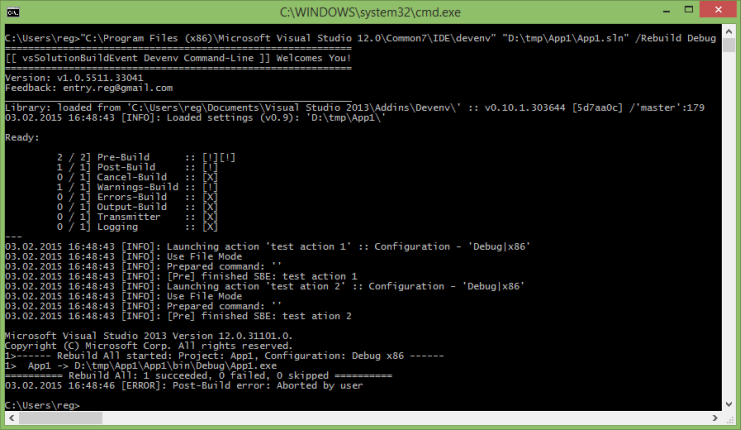

# vsSolutionBuildEvent Devenv

Module to support the [Devenv Command-Line](https://msdn.microsoft.com/en-us/library/vstudio/xee0c8y7.aspx) of the Visual Studio.

**Please note**: you can also use **[CI.MSBuild](../../CI/CI.MSBuild/)** module for work through MSBuild tools.




Devenv Command-Line only supports the following: Visual Studio 2010, 2012, 2013. Features are not available for [VSPackages](https://msdn.microsoft.com/en-us/library/bb166424.aspx) that was possible only because of our [tricks](https://bitbucket.org/3F/vssolutionbuildevent/issue/25/).

 Please consider upgrading to modern **[CI.MSBuild](../../CI/CI.MSBuild/)**

-------

## How to get & Install

* Download *[{{site.lnkCur_Devenv[1]}}]({{site.lnkCur_Devenv[2]}})*
    * Archive binaries: [{{site.lnkAll_Devenv[0]}}]({{site.lnkAll_Devenv[1]}})

Currently the Devenv module distributed only as an additional wrapper (~41 kb) for work with vsSolutionBuildEvent through [API](../../API/). Means you must have this library to continue working.

* Unpack the Devenv archive into `%HOMEPATH%\Documents\` -> `Visual Studio <num>\Addins` folder (see full instruction in [MSDN](https://msdn.microsoft.com/en-us/library/19dax6cz.aspx)). *(you can also delete all *.pdb files from archive)*
    * For example: `C:\Users\<user>\Documents\Visual Studio 2013\Addins\`
*  should be already installed for your Visual Studio. **Or** [Download]({{site.lnkList_VSPackage[1][2]}}) and extract all files from ([.vsix](https://msdn.microsoft.com/en-us/library/ff407026.aspx)) into `%HOMEPATH%\Documents\Visual Studio 2013\Addins\Devenv\`

That's all.

## How to use

After install you can use the vsSolutionBuildEvent with [Devenv](https://msdn.microsoft.com/en-us/library/vstudio/xee0c8y7.aspx), for example:

```{{site.msblang}}
"C:\Program Files (x86)\Microsoft Visual Studio 12.0\Common7\IDE\devenv" "D:\tmp\App1\App1.sln" /Rebuild Debug
```

You can also use the `verbosity` key for details information from vsSolutionBuildEvent - `verbosity:diagnostic` (**debug mode**), for example:

```{{site.msblang}}
"C:\Program Files (x86)\Microsoft Visual Studio 12.0\Common7\IDE\devenv" "D:\tmp\App1\App1.sln" verbosity:diagnostic /Build Release
```

For more details about Command Line mode see [MSDN documentation](https://msdn.microsoft.com/en-us/library/vstudio/xee0c8y7.aspx)




### Newtonsoft.Json.JsonSerializationException: Error setting value to ...

If you see similar error:

* Try to update manually your old Json library, or remove it. Path, for example:

```
C:\Program Files\Common Files\Microsoft Shared\Visual Studio\12.0\Newtonsoft.Json.dll
```
More details about bug **[here](https://github.com/JamesNK/Newtonsoft.Json/issues/647)**


# References

* [vsSolutionBuildEvent CI.MSBuild](../CI.MSBuild/)
* [Scripts & Commands](../../Scripts/)
* [Examples](../../Examples/)