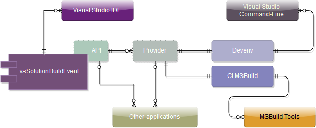

## Complete solutions

* [Automatic Version Numbering](Version/)
    * [Manually](Version/Manually/)
    * [Wizard](Version/Wizard/) - *Automatic code generation*
    * [Simple variant](Version/Simple/)
* [Artefacts. How to prepare as you want](Artefacts/)
* [Stop build on first error](Errors.Stop build/)
* [Demo projects](Demo/)
* [Reload projects in solution](ReloadProjects/)
* [Advanced work with Git submodules](Git/Submodules/)
* [Native scripting. World without Visual Studio](NativeScripting/)

## Some features

* [Math operations](../Features/Math/)
* [Date & Time](../Features/Date & Time/)
* [.vssbe File format & Unified Project name for different .sln](../Features/.vssbe/)
* [Actions for specific configuration](../Features/Actions for specific configuration/)
* [Solution-wide Build Events](../Features/Solution-wide/)
* [Confirmation dialog](../Features/Confirmation dialog/)
* [Work with Unit-Tests & EnvDTE](../Features/EnvDTE & Tests/)
* [Exclude projects from build on Pre-Build event](../Features/Exclude projects/)
* [Work with external utilities](../Features/External utilities/)
* [Increment & Decrement Numbers [custom counters]](../Features/Custom counters/)
* [Operations with strings](../Features/Strings/)
* [Remote servers](../Features/Remote/)

## Processing modes

* [Processing modes](../Modes/)

## Events

* [Available Events](../Events/)

## Scheme of vsSolutionBuildEvent

Read [here](../Scheme/)

## For developers

See [Developer Zone](../Dev/) - *How to build plugin; How to create component for current platform; API; etc.*

## Your experience

Feel free to improve any our pages. Click [Edit] button below or Start new page [here](../New/).

*From the short useful script/note to the complete solution for other our users. It can be as part of [donation]({{site.baseurl}}/Donation/) or simple note to self etc.*