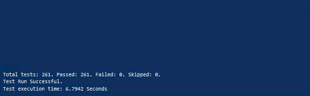
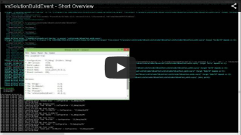
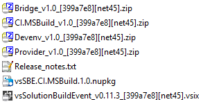

# Artefacts. How to prepare as you want




*Artefacts / Binaries from build project, etc.*

You can see also a fragment of this from our short overview:

[](http://youtu.be/FX5GiMX0ulI)

## CI / Special Build Servers / Devenv

Well., not important where use it.. 

Simply configure and use any scripts for any environments. It means you should see the same result on your PC(for example) and for another with identical script:



You can also read this:

* How to work with [CI components](../../CI/).
* [.vssbe for each .sln (Solution File)](../../Features/.vssbe/)

## Releases from a few projects

*Full sample you can see in our project, for example:  [Full script for assembling the vsSolutionBuildEvent v0.11](https://gist.github.com/3F/3f2f56dfc2a01dc99c63) (actual version in current [script file](https://bitbucket.org/3F/vssolutionbuildevent/src/master/.vssbe))*

As result [you should see next files](https://ci.appveyor.com/project/3Fs/vssolutionbuildevent/build/build-120/artifacts) (i.e. only for example - your variants **can be as you want**) for any deploy or simple use:

Samples:

File                            | Description
---------------------------- | ---
bin\Releases\Bridge_v1.0_[399a7e8][net40].zip| Packed binaries from 'Bridge' project as part of main project.
bin\Releases\CI.MSBuild_v1.0_[399a7e8][net40].zip | Packed binaries from 'CI.MSBuild' project as part of main project.
bin\Releases\Devenv_v1.0_[399a7e8][net40].zip | Packed binaries from 'Devenv' project as part of main project.
bin\Releases\Provider_v1.0_[399a7e8][net40].zip | Packed binaries from 'Provider' project as part of main project.
bin\Releases\Release_notes.txt | Auto-generated notes from current assemblies.
bin\Releases\vsSBE.CI.MSBuild.1.0.nupkg | NuGet package from 'CI.MSBuild' project.
bin\Releases\vsSolutionBuildEvent_v0.11.3.47103_[399a7e8][net40].vsix | VSPackage of main project.


Contents of the Release_notes.txt:

```text 

This assembled from:

* Configuration:   'CI_Debug' (Folders: Debug)
* .NET version:     v4.5 (be careful - need a v4.0 to compatibility with VS2010);
* Build number:     47103;
* Branch Sha1:      399a7e8;
* Branch Name:      master;
* Branch revCount:  212;
------------------------------------------

Versions:

* The 'Bridge':                 v1.0;
* The 'CI.MSBuild':             v1.0;
* The 'Devenv':                 v1.0;
* The 'Provider':               v1.0;
* The 'vsSolutionBuildEvent':   v0.11.3.47103;

------------------------------------------
					 Generated by vsSolutionBuildEvent

```

is ready ? ok, see below..

### How to




*Please note*: 

* You can achieve this results with [our different modes](../../Modes/).
* [Convenience work with single lines arguments /strings](../../Features/Strings/)

Firstly, you should to decide how will be numbered versions of all your projects - this can be as [here](../Version number/) or others.

For packing you can use free [7za](http://sourceforge.net/projects/sevenzip/files/7-Zip/9.20/7za920.zip/download) archiver ([7-Zip Command line version](http://www.7-zip.org)) or similar.

* Select event type - "Post-Build".
* Change "Processing mode" to 'Script Mode'
* Add action & Activate [SBE-Scripts](../../Scripts/SBE-Scripts/) support

Write next script, for example:

* Definitions:

```minid 

#[var appzip    = $(SolutionDir)bin/7z/7za.exe]
#[var odir      = $(SolutionDir)bin/Releases/]
#[var cfg       = #[($(Configuration) ~= "Release"){Release}else{Debug}]]
#[var cfgFull   = $(Configuration)]
 
#[var netStamp      = net$(TargetFrameworkVersion.Replace(".", "").Replace("v", ""))]
#[var netVerString  = $(TargetFrameworkVersion)#[($(TargetFrameworkVersion) != v4.0){ (be careful - need a v4.0 to compatibility with VS2010)}]]
```


* Packing - 'Bridge'

```minid 

#[File cmd("cd \"#[var pDirBridge]bin/#[var cfg]/\" & \"#[var appzip]\" a \"#[var odir]Bridge_v#[var numBridge]_[#[var branchSha1]][#[var netStamp]].zip\" *.*")]
```

* Packing - 'CI.MSBuild'

```minid 

#[File cmd("cd \"#[var pDirCIM]bin/#[var cfg]/\" & \"#[var appzip]\" a \"#[var odir]CI.MSBuild_v#[var numCIM]_[#[var branchSha1]][#[var netStamp]].zip\" *.*")]
```


* Packing - 'Devenv'

```minid 

#[File cmd("cd \"#[var pDirDevenv]bin/#[var cfg]/\" & xcopy *.dll Devenv /Y/R/I & xcopy *.pdb Devenv /Y/R/I")] 
#[File cmd("cd \"#[var pDirDevenv]bin/#[var cfg]/\" & \"#[var appzip]\" a \"#[var odir]Devenv_v#[var numDevenv]_[#[var branchSha1]][#[var netStamp]].zip\" Devenv.AddIn Devenv/*.*")] 
```


* Packing - 'Provider'

```minid 

#[File cmd("cd \"#[var pDirProvider]bin/#[var cfg]/\" & \"#[var appzip]\" a \"#[var odir]Provider_v#[var numProvider]_[#[var branchSha1]][#[var netStamp]].zip\" *.*")]
```


* Packing - 'vsSolutionBuildEvent'

```minid 

#[File cmd("cd \"#[var pDir]bin/#[var cfg]/\" & copy vsSolutionBuildEvent.vsix \"#[var odir]vsSolutionBuildEvent_v#[var numSBE]_[#[var branchSha1]][#[var netStamp]].vsix\"")]
```


* NuGet Packing - 'vsSBE.CI.MSBuild'

```minid 


#[var tplNuspecCIM = #[File get("vsSBE.CI.MSBuild.nuspec.tpl")]]
#[var nupCIMdir = $(odir)NuGet-CI.MSBuild-package]
 
#[File cmd("mkdir \"#[var nupCIMdir]\" 2>&1")]
#[File cmd("del /F/Q \"#[var nupCIMdir]\" & del /F/Q \"#[var nupCIMdir]\bin\" 2>&1")]
 
#[var nuspecCIM = $(tplNuspecCIM.Replace(%CIMVersion%, "$(numCIM)").Replace(%PackageVersion%, "").Replace(%vsSBEVersion%, "$(numSBE)"))]
#[File write("#[var nupCIMdir]\vsSBE.CI.MSBuild.nuspec"):#[var nuspecCIM]]
 
#[" files for package "]
 
#[File cmd("cd \"#[var pDir]bin/#[var cfg]/\" & xcopy *.dll \"#[var nupCIMdir]\bin\" /Y/R/I & xcopy NLog.dll.nlog \"#[var nupCIMdir]\bin\" /Y/R/I")]
#[File cmd("cd \"#[var pDirCIM]bin/#[var cfg]/\" & xcopy *.dll \"#[var nupCIMdir]\bin\" /Y/R/I")]
#[File scall(".nuget\nuget.exe", "pack \"#[var nupCIMdir]\vsSBE.CI.MSBuild.nuspec\" -OutputDirectory \"#[var nupCIMdir]\..\" -NonInteractive")] 
```

Where - '[vsSBE.CI.MSBuild.nuspec.tpl](https://bitbucket.org/3F/vssolutionbuildevent/src/master/vsSBE.CI.MSBuild.nuspec.tpl)' is a template e.g.:

```xml 

<?xml version="1.0"?>
<package >
  <metadata>
    <id>vsSBE.CI.MSBuild</id>
    <title>vsSolutionBuildEvent CI.MSBuild</title>
    <version>%CIMVersion%%PackageVersion%</version>
    <authors>...</authors>
    <owners>...</owners>
    <licenseUrl>...</licenseUrl>
    <projectUrl>...</projectUrl>
    <requireLicenseAcceptance>false</requireLicenseAcceptance>
    <description>                   
    ...
    </description>
    <releaseNotes>Updated the vsSolutionBuildEvent library: v%vsSBEVersion%</releaseNotes>
    <copyright>...</copyright>
    <tags>...</tags>
  </metadata>
</package>
```

* 'Release_notes.txt' for current assemblies:

```bat 

#[File write("#[var odir]/Release_notes.txt"):This assembled from:

* Configuration:   '#[var cfgFull]' (Folders: #[var cfg])
* .NET version:     #[var netVerString];
* Build number:     #[var revBuild];
* Branch Sha1:      #[var branchSha1];
* Branch Name:      #[var branchName];
* Branch revCount:  #[var branchRevCount];
------------------------------------------

Versions:

* The 'Bridge':                 v#[var numBridge];
* The 'CI.MSBuild':             v#[var numCIM];
* The 'Devenv':                 v#[var numDevenv];
* The 'Provider':               v#[var numProvider];
* The 'vsSolutionBuildEvent':   v#[var numSBE];

------------------------------------------
\t\t\t\t\t Generated by vsSolutionBuildEvent
]
```

#### Explanation for script above

In 'Definitions' section simply defined some variables for a quick accessing to some data. Link to archiver for example:

```minid 

#[var appzip = $(SolutionDir)bin/7z/7za.exe]
```
For more details you should see:

* [UserVariableComponent](../../Scripts/SBE-Scripts/Components/UserVariableComponent/)
* [MSBuild](../../Scripts/MSBuild/)

In 'Packing ...' sections we use [FileComponent](../../Scripts/SBE-Scripts/Components/FileComponent/) for copy & archive our binaries from projects with defined paths and file formats.

For more details you should see:

* Documentation for 7za: Distributive packet contains the '7-zip.chm' - User's Manual in HTML Help format. Otherwise see [7-zip.org](http://www.7-zip.org)
* System utilities - [xcopy & copy](http://support.microsoft.com/en-us/kb/240268) - Use `copy /?`, `xcopy /?` commands for documentation.

For 'NuGet Packing ...' used all above including:

* [MSBuild Property Functions](https://msdn.microsoft.com/en-us/library/vstudio/dd633440%28v=vs.120%29.aspx)
* [nuget.exe](https://www.nuget.org/nuget.exe) utility ([documentation](http://docs.nuget.org/Consume/Command-Line-Reference))

And finally generated the 'Release_notes.txt' with [FileComponent](../../Scripts/SBE-Scripts/Components/FileComponent/)

As result:

* All packages should appears in **bin\Release** folder.
    * You should ignore this folder in your scm ([.gitignore](http://git-scm.com/docs/gitignore), .hgignore, .bzrignore, svn:ignore, etc.,)

Working example you can see in:

* [Source code](https://bitbucket.org/3F/vssolutionbuildevent/src)
    * [Script file](https://bitbucket.org/3F/vssolutionbuildevent/src/master/.vssbe) ([Gist](https://gist.github.com/3F/3f2f56dfc2a01dc99c63))
* [ci.appveyor.com](https://ci.appveyor.com/project/3Fs/vssolutionbuildevent/build/build-120)

# Remote servers

* [Examples with FTP and other](../../Features/Remote/)


# References

* [Operations with strings](../../Features/Strings/)
* [Automatic Version Numbering](../Version number/)
* [Processing modes](../../Modes/)
* [SBE-Scripts](../../Scripts/SBE-Scripts/)
* [MSBuild](../../Scripts/MSBuild/)
* [Visual Studio Gallery page](http://visualstudiogallery.msdn.microsoft.com/0d1dbfd7-ed8a-40af-ae39-281bfeca2334/)
* [Examples & Features](../../Examples/)
