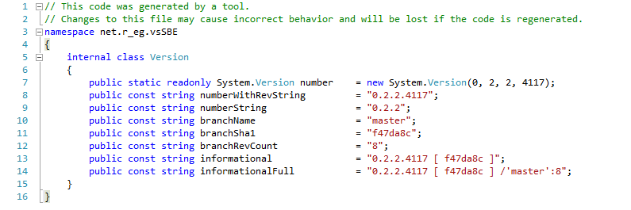

# Automatic Version Numbering



**Please note**: You can achieve this or similar results with [our different modes](../../Modes/). 

For simplicity, we consider the [Script Mode](../../Modes/Script/). **However**, feel free - If you don't like this - use many other variants, for example with [Targets Mode](../../Modes/Targets/) or [C# Mode](../../Modes/CSharp/), or with [simple caller](../../Features/Confirmation dialog/) and [others](../../Examples/)

*This variant is also used in our project:  [Full script for assembling the vsSolutionBuildEvent v0.11](https://gist.github.com/3F/3f2f56dfc2a01dc99c63) (actual version in current [script file](https://bitbucket.org/3F/vssolutionbuildevent/src/master/.vssbe))*

## Synopsis

This method should automatically generate the Version class, e.g.: ↘

```csharp 

// This code was generated by a tool
namespace example
{
    internal class Version
    {
        public static readonly System.Version number    = new System.Version(0, 12, 2, 1917);
        public const string numberWithRevString         = "0.12.2.19917";
        public const string numberString                = "0.12.2";
        public const string branchName                  = "local_API_Reverse";
        public const string branchSha1                  = "f05afc9";
        public const string branchRevCount              = "274";
        public const string informational               = "0.12.2.1917 [ f05afc9 ]";
        public const string informationalFull           = "0.12.2.1917 [ f05afc9 ] /'local_API_Reverse':274";
    }
}
```

*Similarly for others... e.g. for C++ you can also use preprocessor directives - #define (macro definitions):*

```cpp 

#ifndef REVISION_H 
  #define REVISION_STR "%VersionRevString% [ %branchSha1% ] /'%branchName%':%branchRevCount%" 
  #define L_REVISION_STR L"%VersionRevString% [ %branchSha1% ] /'%branchName%':%branchRevCount%" 
#endif 
```
*or similar class as above..*

**Then,** you can use this in different places, for example:

• Attribute to VSPackage class: 

```csharp 

[InstalledProductRegistration("#110", "#112", Version.numberWithRevString, IconResourceID = 400)]
```

• AssemblyInfo:

```csharp 

[assembly: AssemblyVersion(Version.numberString)]
```

• Other places, for example:

```csharp 

  toolVersion.Text = string.Format("v{0} [ {1} ]", Version.numberString, Version.branchSha1);
```
[etc.,](https://gist.github.com/3F/f54ad9736a9cbb984785)


**Note:** For example, for **.vsixmanifest** ([VSPackages /VSIX Package](https://msdn.microsoft.com/en-us/library/bb166424.aspx)) *or similar*, it's a little harder... We can't use this directly, therefore we may update this only as replacement, for example: 

* Change "Processing mode" to 'Script Mode'
* Add action & Activate [SBE-Scripts](../../Scripts/SBE-Scripts/) support
* Use next script, for example:

```java 

#[File replace.Regexp("source.extension.vsixmanifest", "<Version>[0-9\.]+</Version>", "<Version>#[var number]</Version>")]
```
**Where**, `#[var number]` it's your number(see [UserVariableComponent](../../Scripts/SBE-Scripts/Components/UserVariableComponent/)). You can manage this value with next variants, for example:

* Getting from [MSBuild Property](../../Scripts/MSBuild/) `#[var number = $(name)]` or `$(number = $(name))`
* Getting from file: `#[var number = #[File get(".version")]]`
* Getting from your external utility(stdout): `#[var number = #[File sout("updv.exe", "-s new")]]`
* Manually set - `#[var number = 1.2.3]` or `$(number = "1.2.3")`
* Other with [MSBuild](../../Scripts/MSBuild/) & [SBE-Scripts](../../Scripts/SBE-Scripts/)
* etc.

**Note:** The `<Version>` in .vsixmanifest follows the CLR assembly versioning format: Major.Minor.Build.Revision (1.2.40308.00). see MSDN:

* [VSIX Extension Schema 2.0 Reference](http://msdn.microsoft.com/en-us/library/hh696828.aspx)
* [System.Version](http://msdn.microsoft.com/en-us/library/System.Version%28v=vs.110%29.aspx)

## Generating the Version class & Build/revision Number

* Create template of Version class e.g.: **Version.tpl** with what you want, using placeholders instead of real values - sample for C#:

```csharp 

namespace example
{
    class Version
    {
        public static readonly System.Version number    = new System.Version(%Version%);
        public const string numberWithRevString         = "%VersionRevString%";
        public const string numberString                = "%VersionString%";
        public const string branchName                  = "%branchName%";
        public const string branchSha1                  = "%branchSha1%";
        public const string branchRevCount              = "%branchRevCount%";
    }
}
```

* Create file e.g.: **.version** and write current number of your project like a **major**.**minor**. and similar
* Select event type - "Pre-Build".
* Change "Processing mode" to 'Interpreter Mode' or 'Script Mode'
* Activate [SBE-Scripts](../../Scripts/SBE-Scripts/) support
* Activate [MSBuild](../../Scripts/MSBuild/) support
* Write next script, for example:

*See also - [Custom counters](../../Features/Custom counters/) & [Date & Time](../../Features/Date & Time/) features for details about limitations for revBuild if you work in team.*

```minid 

#[" 
    Define variables
"]
#[var ver   = #[File get(".version")]]
#[var tpl   = #[File get("Version.tpl")]]
#[var pDir  = $(SolutionDir)\subproject]


#[" 
    Calculate revBuild
"]
$(tStart    = $([System.DateTime]::Parse("2015/08/08").ToBinary()))
$(tNow      = $([System.DateTime]::UtcNow.Ticks))
$(revBuild  = $([System.TimeSpan]::FromTicks($([MSBuild]::Subtract($(tNow), $(tStart)))).TotalMinutes.ToString("0")))


#[" 
    Replacing placeholders
"]
#[var cs = $(tpl.Replace("%Version%", "$(ver.Replace('.', ', ')), $(revBuild)"))]
#[var cs = $(cs.Replace("%VersionRevString%", "$(ver).$(revBuild)").Replace("%VersionString%", "$(ver)"))]


#[" 
    Checks availability of git folder +tool & retrieving sha1, branch name, etc.
"]

#[( #[File exists.directory(".git")] && #[File exists.file("git.exe", true)] ) {

    #[var branchSha1        = #[File sout("git", "rev-parse --short HEAD")]]
    #[var branchName        = #[File sout("git", "rev-parse --abbrev-ref HEAD")]]
    #[var branchRevCount    = #[File sout("git", "rev-list HEAD --count")]]
    
    #[var cs = $(cs.Replace("%branchName%", "#[var branchName]").Replace("%branchSha1%", "#[var branchSha1]").Replace("%branchRevCount%", "#[var branchRevCount]"))]
}
else {
    #[var cs = $(cs.Replace("%branchName%", "-").Replace("%branchSha1%", "-").Replace("%branchRevCount%", "-"))]
}]


#[" 
    Save our result from cs variable as Version.cs in pDir path
"]
#[File write("#[var pDir]\Version.cs"):#[var cs]]


#[" 
    Special .vsixmanifest finalization - see above
"]
#[File replace.Regexp("#[var pDir]/source.extension.vsixmanifest", "<Version>[0-9\.]+</Version>", "<Version>#[var ver]</Version>")]
```
* Activate event and click apply.

As result you will see **Version.cs** as above (should be included in main project with the `Build Action` as `Compile`) and **.vsixmanifest** file with updated number.

Also you can use the conditions for rev. number, for example:

```minid 

#[($(Configuration) == "Release"){
    #[var ver = #[var ver].#[var revBuild]]
}]
...
#[File replace.Regexp("source.extension.vsixmanifest", "<Version>[0-9\.]+</Version>", "<Version>#[var ver]</Version>")]
```
In example above, should be 0.9.0.**176489** for **Release** configuration and 0.9.0 for another

Note:

This hard line in example above:

```minid 

#[var cs = $(tpl.Replace("%Version%", "$(ver.Replace('.', ', ')), $(revBuild)"))]
```

may be converted to simple:

```minid 

#[var ver   = $(ver.Replace(".", ", ")), $(revBuild)]
#[var tpl   = $(tpl.Replace("%Version%", "$(ver)"))]
```
            
and similar... 

* *[Sample of how to use it for 'Assembly' attributes etc.](https://gist.github.com/3F/f54ad9736a9cbb984785)*

You can also test/debug all scripts with our testing tools, look in the `Settings` - `Tools`

# References

* [Processing modes](../../Modes/)
* [Custom counters](../../Features/Custom counters/)
* [Date & Time](../../Features/Date & Time/)
* [Artefacts. How to prepare as you want](../Artefacts/)
* [SBE-Scripts](../../Scripts/SBE-Scripts/)
* [MSBuild](../../Scripts/MSBuild/)
* [Visual Studio Gallery page](http://visualstudiogallery.msdn.microsoft.com/0d1dbfd7-ed8a-40af-ae39-281bfeca2334/)
* [Examples & Features](../../Examples/)
