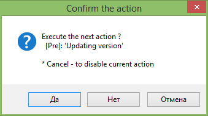
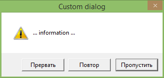
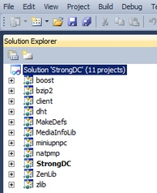
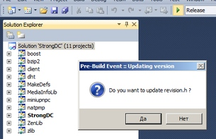

# Confirmation dialog / Prompt window

In latest versions you can use special option for your [scripts](../../Scripts/). 



* Simply add any action type for any events
* In `Control` section set the **Confirmation** option.


This can be useful for most operations. However you can also use own dialogs, see below.


## Custom dialogs

You can use any own dialog if needed, for example:

* Activate [SBE-Scripts](../../Scripts/SBE-Scripts/) support
* Use script for example:

```{{site.sbelang1}}
#[(#[File sout("cscript", "//nologo dialog.vbs")]) {

    ... your action if 'Yes'

}]
```

* Where dialog.vbs it's a simple [vbscript](http://ss64.com/vb/) with [msgbox](http://ss64.com/vb/msgbox.html), for example:

```vb
' Sample of dialog
ret = MsgBox("... information ...",  vbAbortRetryIgnore + vbDefaultButton3 + vbExclamation , "Custom dialog")

' this result we should set to our script above, for example:
If ret = vbYes Then
    Wscript.Echo "true"
Else
    Wscript.Echo "false"
End If
```


similarly, you can also use any other script language..

**Note:** Should be enabled the [ConditionComponent](../../Scripts/SBE-Scripts/Components/ConditionComponent/) for [SBE-Scripts](../../Scripts/SBE-Scripts/) core.

### External logic. Simple caller (or variant for older versions < v0.9)




See also - [Work with external utilities](../../Features/External utilities/) for details about this.

The information below is an deprecated variant. But if you still like this:

For example, if you have a few subprojects in your solution as here:



and you want to update some file at start build **for all projects at once**(as Solution-wide) for example: revision.h 

```cpp
#ifndef REVISION_H 
  #define REVISION_STR "31 [support::4b9a0cf]" 
  #define L_REVISION_STR L"31 [support::4b9a0cf]" 
#endif 
```


It can be generated with your some tool, for example, simple revision.bat and similar [vbscript](http://ss64.com/vb/) with [msgbox](http://ss64.com/vb/msgbox.html) for confirmation to user:

* revision.bat:

```{{site.msblang}}
...
  : rev count 
  FOR /F %%i IN ('git rev-list HEAD --count') DO set git_rev_count=%%i 
  : rev SHA1 short 
  FOR /F %%i IN ('git rev-parse --short HEAD') DO set git_rev_sha1=%%i 
...
```

revision.vbs:

```vb
ret = MsgBox("Do you want to update revision.h ?", vbYesNo + vbQuestion, "Pre-Build Event :: Updating version") 
 
If ret = vbYes Then 
    Set shell = WScript.CreateObject("WScript.Shell") 
    code = shell.Run("revision.bat", 1, true) 
    If code <> 0 Then 
        MsgBox "The script exited with code: " & code, vbOKOnly + vbExclamation, "Pre-Build Event :: Updating version" 
    End If 
End If
```
and similar..


Then,

* Select Pre-Build event
* Add action with processing as 'Files Mode' and call the revision.vbs

as result you simply call external script with your fully external logic & your confirmation dialog for all projects at once:



`*!*` *please note that is deprecated, see also [here](../../Examples/Version/)* `*!*`

# References

* [SBE-Scripts](../../Scripts/SBE-Scripts/)
* [Examples & Features](../../Examples/)
