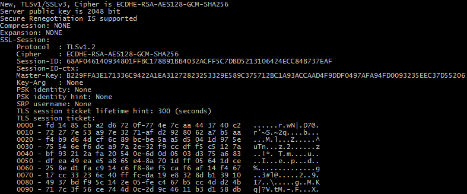

# Work with external utilities



## Basic work

All simple modes like [Files Mode]({{site.docp}}/Modes/Files/), [Interpreter Mode]({{site.docp}}/Modes/Interpreter/) can be used for work with any external utilities.

You can call what you want and easy get result from the output (STDOUT, STDERR). For example (old samples):

* [get changes between revisions](https://gist.github.com/3F/48dea90aae98ddb64d3a)
* [update revision with data from SCM - git](https://gist.github.com/3F/e0d88d4d5c90df1e9a96)
* [parsing of .html files and generating cshelp.h with C++ macro definitions](https://gist.github.com/3F/c98f172cf97f647c8470)

**However!** you can much more. see below

## Advanced work

A complex work with data from any external tools and features that are not available for [MSBuild](../../Scripts/MSBuild/):

* Select suitable mode: [Processing modes]({{site.docp}}/Modes/)

Try to use existing component of [SBE-Scripts](../../Scripts/SBE-Scripts/) engine like:

* [FileComponent](../../Scripts/SBE-Scripts/Components/FileComponent/) - IO operations, including work with executable files.
* [SevenZipComponent]({{site.docp}}/Scripts/SBE-Scripts/Components/SevenZipComponent/) - additional features for work with archives.

Of course all data from external utilities can be used for User-Variables, MSBuild Properties,  Conditional statements, etc. for your complex scripts.

### Examples

*Please also note - [Operations with strings](../Strings/)*





#### Calculate sha1 for string with openssl

[openssl](https://www.openssl.org/docs/apps/openssl.html)

* Sha1 for 'Hello World!'

```{{site.sbelang1}}
#[File cmd("echo 'Hello World!'| openssl sha1 | sed 's/^.*\s//'")]
```
Result: `2ef7bde608ce5404e97d5f042f95f89f1c232871`

* Sha1 for current time:

```{{site.sbelang1}}
#[var utcnow = $([System.DateTime]::UtcNow.Ticks)]
#[File cmd("echo '#[var utcnow]'| openssl sha1 | sed 's/^.*\s//'")]
```
Result: `47c14be77bc0a13a0454e1ad2e9a642549f467fc`

Note: For your environment use also: `echo -n "str"`, `printf 'str'` etc. *On Windows platform with standard `echo` you can get incorrect hash value.*

#### Internal support of MD5 & SHA-1

[v0.12.4+ now supports](../../Scripts/SBE-Scripts/Components/FunctionComponent/#hash) calculating MD5 & SHA1 for more convenience.

```{{site.sbelang1}}
#[Func hash.MD5("Hello World!")]
```

Result: `ED076287532E86365E841E92BFC50D8C`

```{{site.sbelang1}}
#[Func hash.SHA1("Hello World!")]
```

Result: `2EF7BDE608CE5404E97D5F042F95F89F1C232871`

#### Version number of package from NuGet server

NuGet command line tool - [nuget.exe](https://www.nuget.org/nuget.exe) ([documentation](http://docs.nuget.org/Consume/Command-Line-Reference))

for example:

```{{site.sbelang1}}
#[File cmd("nuget list Moq | grep -e \"^Moq \"", 30)]
```
Result: `Moq 4.2.1502.0911`

* Next patch number for latest package, for example:

```{{site.sbelang1}}
$([MSBuild]::Add(#[File sout("cmd", "/C .nuget\nuget.exe list vsSBE.CI.MSBuild | grep 'vsSBE.CI.MSBuild' | sed -r 's/^.*\s[0-9]+\.[0-9]+\.//'", 30)], 1))
```
Result: `1.0.5` -> `1.0.6`

#### Packing files. Create Archives from binaries

For packing you can use external 7-zip archiver. **However**, now it can be much more easier:

* [SevenZipComponent]({{site.docp}}/Scripts/SBE-Scripts/Components/SevenZipComponent/)

```{{site.sbelang}}
#[7z pack.files(
        {
            "$(oraw)\Readme.md", 
            "$(oraw)\LICENSE",
            "$(oraw)\changelog.txt",
            "$(orawApp)\include\*.h",
            "$(orawApp)algo.exe", 
            "$(orawApp)regXwild.dll",
            "$(orawApp)regXwild.pdb"
        }, 
        "$(odir)regXwild_v$(pVer)[$(Configuration)-$(Platform)][$(CharacterSet:regXwild)].zip")]
```

```{{site.sbelang}}
#[IO copy.file({
                "packages/ILAsm/bin/Win.x86/*.dll",
                "packages/ILAsm/bin/Win.x86/*.exe",
                "packages/ILAsm/*.txt",
                "packages/ILAsm/*.md"
               }, 
               "$(odir)/tools/coreclr/", true)]
```

see also '[Artefacts](../../Examples/Artefacts/)' as a complete solutions.


# References

* [Operations with strings](../Strings/)
* [MSBuild](../../Scripts/MSBuild/)
* [SBE-Scripts](../../Scripts/SBE-Scripts/)
    * [FileComponent](../../Scripts/SBE-Scripts/Components/FileComponent/)
    * [FunctionComponent](../../Scripts/SBE-Scripts/Components/FunctionComponent/)
    * [SevenZipComponent]({{site.docp}}/Scripts/SBE-Scripts/Components/SevenZipComponent/)
* [Examples & Features](../../Examples/)