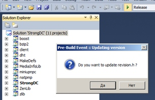

# Solution-wide Build Events

All your actions for `Pre-Build` / `Post-Build` events are already can be **for all projects at once** or **individually for each**. 

*(You should remember this for work with [MSBuild](../../Scripts/MSBuild/) engine etc.)*

[](../Confirmation dialog/)

It should be useful for most cases, for example: 

* [Automatic Version Numbering](../../Examples/Version number/) for your projects.
* Or simple notification like - send email before/after building of all projects:

```php 

mail('yourmail@example.com', 'Build completed', date('H:i:s'));
```
* etc.

Use it with simple caller (by your external logic) or as internal scripts with any interpreters such as php, python, PowerShell, Wscript, Node.js, etc.
Or use powerfull [MSBuild](../../Scripts/MSBuild/) & [SBE-Scripts](../../Scripts/SBE-Scripts/) engines, etc.

For more complex scripts see our **[available modes](../../Modes/)** and ~feel~free~ ...

# What's exists for work without plugins ?

*In some cases*, any extending of Visual Studio may be not suitable or not comfortable for some reasons (for example, your some box-solution, etc.)

Firstly, yes, our product may work **without** Visual Studio. 

* You should see [CI.MSBuild](../../CI/CI.MSBuild/) (not requires installation, simply use 'as is'), and as full sample of how it's works, see [Sample 1](../../Examples/Demo/#sample-1)
    * *full [scheme of our projects](../../Scheme/)*

But a some reason may still require a very simple variant without any additions (it's really can be **only** for special case). So you can try other our solution - [Variant 2: Targets & Map of projects](http://stackoverflow.com/a/18311007) (stackoverflow.com/a/18311007)

* Complete script of this solution you can find [here](https://gist.github.com/3F/a77129e3978841241927) - *it's not recomended, but you also may like this*.


# References

* [Processing modes](../../Modes/)
* [Available Events](../../Events/)
* [Automatic Version Numbering](../../Examples/Version number/)
* [Exclude projects from build on Pre-Build event](../Exclude projects/)
* [Confirmation dialog](../Confirmation dialog/)
* [Actions for specific configuration](../Actions for specific configuration/)
* [MSBuild](../../Scripts/MSBuild/)
* [SBE-Scripts](../../Scripts/SBE-Scripts/)
* [Examples & Features](../../Examples/)