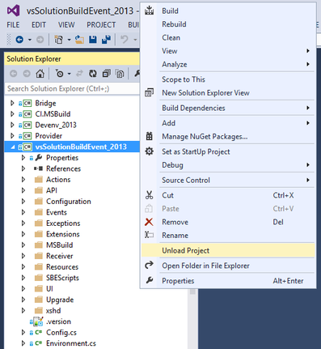
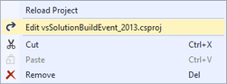
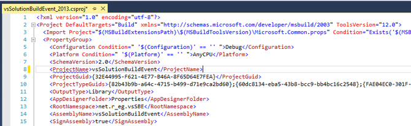
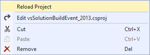

# .vssbe

All shared settings for program stored in solution directory as **.vssbe** text-based file.

**[v0.9+](/Changelist/#vsix)** uses the [JSON format](http://json.org) (text-based language-independent data interchange format)

You can also ignore this from your repo with scm ([.gitignore](http://git-scm.com/docs/gitignore), .hgignore, .bzrignore, svn:ignore, etc.,)

## .vssbe for each .sln (Solution File)

For [v0.11.2+](/Changelist/#vsix) you can also define the special version of configuration file for specific solution.

`<SolutionFile>.vssbe`

For example:

If you have a different solution files:

* app_2012.sln
* app_2013.sln
etc.

you can also define specific configuration like this:

* app_2012.vssbe
* app_2013.vssbe
etc.

The specific configuration in the priority if the **.vssbe** used along with **[SolutionFile].vssbe**. 

## .vssbe.user

The `.vssbe.user` appeared in [v0.12.4](/Changelist/#vsix) as user configuration (for specific user).

We strongly recommend to ignore this from your SCM, 
because this contains settings e.g.: 
value of zooming & Word wrapping of main editor, DebugMode & CacheData of binaries for [C# Mode](../../Modes/CSharp/), etc.

# Unified Project name for different .sln




You can see a some problems with [MSBuild](../../Scripts/MSBuild/) / [SBE-Scripts](../../Scripts/SBE-Scripts/), incorrect behaviour with 'Execution Order' feature etc. If used a few .sln versions for your project.

For example, [currently](https://github.com/3F/vsSolutionBuildEvent) this project used next solutions:

* vsSolutionBuildEvent.sln
* vsSolutionBuildEvent_2012.sln
* vsSolutionBuildEvent_2013.sln
* vsSolutionBuildEvent_net40.sln

Files above only contains a few projects with different settings, for example:

* Devenv.csproj
    * Devenv_2012.csproj
    * Devenv_2013.csproj
    * Devenv_net40.csproj

And by default the ProjectName can be as 'Devenv_2012', 'Devenv_2013', 'Devenv_net40' if you open .sln

Therefore, you should define the **unified project** name for all used .sln with **ProjectName** property for specific project file:

* Open your solution file in Visual Studio, right click on your project in 'Solution Explorer' and click `Unload Project`:



* Click on `Edit ...`



* Find or define new **PropertyGroup** and place inside the property **ProjectName**

```xml 

  <PropertyGroup>
      ...
      <ProjectName>YourProjectName</ProjectName>
      ...
  </PropertyGroup>
```

for example:



* Save, Close tab with project file and reload project:



That's all. Repeat this steps for others your files.

If you have problems, ask [here](https://bitbucket.org/3F/vssolutionbuildevent/issues/new)

# Optional 'Command__' property

Appeared in [v0.12.4](/Changelist/#vsix) for convenient using directly in file (reading or direct modifications). 

However, the 'Command__' property is temporary and used for compatibility with format **v0.9**.

This can be inconvenient and we also added settings (until upgrade of format) to turn off this field:

* `Settings` - `Plugin` - `Suppress 'Command__' property`