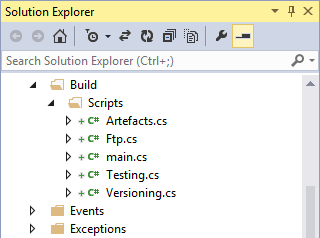

# C# Mode

This action type for work with C# compiler - feel free with all events & actions.

*Available control of caching bytecode and full access to [ICommand](https://github.com/3F/vsSolutionBuildEvent/blob/master/vsSolutionBuildEvent/Actions/ICommand.cs) & [ISolutionEvent](https://github.com/3F/vsSolutionBuildEvent/blob/master/vsSolutionBuildEvent/Events/ISolutionEvent.cs) (can be cast [on similars](https://github.com/3F/vsSolutionBuildEvent/tree/master/vsSolutionBuildEvent/Events))*

## Default Entry point

```csharp 

using ICommand = net.r_eg.vsSBE.Actions.ICommand;
using ISolutionEvent = net.r_eg.vsSBE.Events.ISolutionEvent;

namespace vsSolutionBuildEvent
{
    public class CSharpMode
    {
        public static int Init(ICommand cmd, ISolutionEvent evt)
        {
            return 0;
        }
    }
}
```

## Compiler settings

### References

Additional assembly names that are referenced by the source to compile. You can use any formats below, for example:

```bat 

EnvDTE.dll
C:\WINDOWS\assembly\GAC\EnvDTE\<ver>\EnvDTE.dll
EnvDTE
EnvDTE, Version=8.0.0.0, PublicKeyToken=b03f5f7f11d50a3a
```

### FilesMode flag

As variant, you can also use FilesMode flag in Compiler settings for work with external source codes.

Then you should use list of files instead of code, for example:

```bat 

hooks\*.cs
scripts\vssbe\main.cs
scripts\vssbe\ftp.cs
D:\app\scripts\*.*
```
etc.

So you can also add this in your solution for more productive work, for example:



*Note: In most cases the `Build Action` should be as `None`*

## ICommand & ISolutionEvent objects

The default entry point provides accessing to next objects:

* [ICommand](https://github.com/3F/vsSolutionBuildEvent/blob/master/vsSolutionBuildEvent/Actions/ICommand.cs) - For work with [Actions](https://github.com/3F/vsSolutionBuildEvent/tree/master/vsSolutionBuildEvent/Actions).
* [ISolutionEvent](https://github.com/3F/vsSolutionBuildEvent/blob/master/vsSolutionBuildEvent/Events/ISolutionEvent.cs) - For work with [Events](https://github.com/3F/vsSolutionBuildEvent/tree/master/vsSolutionBuildEvent/Events).

As you can see, you may work with most operations of vsSolutionBuildEvent core, for example:

### Work with MSBuild & SBE-Scripts engine

#### Define UserVariable with value from C# code

You have a few variants for work with UserVariables:

* Parse data via engines:
    * SBE-Scripts: `cmd.SBEScript.parse(...);` (see also [ISBEScript](https://github.com/3F/vsSolutionBuildEvent/blob/master/vsSolutionBuildEvent/SBEScripts/ISBEScript.cs))
    * MSBuild: `cmd.MSBuild.parse(...);` (see also [IMSBuild](https://github.com/3F/vsSolutionBuildEvent/blob/master/vsSolutionBuildEvent/MSBuild/IMSBuild.cs))
* Direct access to [IUserVariable](https://github.com/3F/vsSolutionBuildEvent/blob/master/vsSolutionBuildEvent/Scripts/IUserVariable.cs) object with used Bootloader (see also [IBootloader](https://github.com/3F/vsSolutionBuildEvent/blob/master/vsSolutionBuildEvent/SBEScripts/IBootloader.cs)):
    * `cmd.SBEScript.Bootloader.UVariable`

SBE-Scripts engine. For example:

```csharp 

Stack<string> mv = new Stack<string>();
mv.Push("One");
mv.Push("Two");
mv.Push("Three");

string data = String.Format("#[var mvMap = {0}]", String.Join(";", mv.ToArray()));
cmd.SBEScript.parse(data);
```

As result you can get this value from other actions with standard operations, for example:

* `$(mvMap)` and `#[var mvMap]` - should return value: 'Three;Two;One'

**Please note:** 

if also used the `MSBuild support` option for C# code, for example, for work with msbuild properties:

```csharp 

using(StreamReader reader = new StreamReader(@"$(SolutionPath)", Encoding.Default))
{
    ...
}
```

Don't forget about escaping an sequences, for example:

```csharp 

cmd.MSBuild.parse(String.Format("$$(mvMap = '{0}')", steps.Peek()));
```

*For SBE-Scripts: all elements inside quotes (`"..."`, `'...'`) will be automatically protected from evaluation.*

## Examples

The optional [ICommand](https://github.com/3F/vsSolutionBuildEvent/blob/master/vsSolutionBuildEvent/Actions/ICommand.cs) & [ISolutionEvent](https://github.com/3F/vsSolutionBuildEvent/blob/master/vsSolutionBuildEvent/Events/ISolutionEvent.cs) objects contains most useful points for work with our core.
For example:

* Access to [IEnvironment](https://github.com/3F/vsSolutionBuildEvent/blob/master/vsSolutionBuildEvent/IEnvironment.cs) for getting current build action type:

```csharp 

if(cmd.Env.BuildType != BuildType.Clean) {
    String.Format("Current type: {0}", cmd.Env.BuildType); // Current type: Rebuild
    ...
}
```

* Or direct access to User-variables ([IUserVariable](https://github.com/3F/vsSolutionBuildEvent/blob/master/vsSolutionBuildEvent/Scripts/IUserVariable.cs)) for get/set/or evaluation new variables...
    * For example, with used Bootloader ([IBootloader](https://github.com/3F/vsSolutionBuildEvent/blob/master/vsSolutionBuildEvent/SBEScripts/IBootloader.cs)):

```csharp 

IUserVariable uvar = cmd.SBEScript.Bootloader.UVariable;
if(!uvar.isExist("name1", "projectA")) {
    uvar.set("ret", null, "raw");
    ...
}
```

* and others...

### Visual Studio OutputWindow pane through vsSBE

*Of course you can also prepare [OutputWindow](https://msdn.microsoft.com/en-us/library/envdte.outputwindow.aspx) with [DTE2](https://msdn.microsoft.com/en-us/library/envdte80.dte2.aspx) etc.*

* Activate C# Mode
* Add **'EnvDTE'** reference in `Compiler` - `References`
    * Use `SmartReferences` option for automatically finding, including used domain. **Or** use any available syntax for assemblies.
* Customize cache and check other available flags of optimization. (optional)
* Use next code, for example:

```csharp 

using net.r_eg.vsSBE;
using ICommand = net.r_eg.vsSBE.Actions.ICommand;
using ISolutionEvent = net.r_eg.vsSBE.Events.ISolutionEvent;

namespace vsSolutionBuildEvent
{
    public class CSharpMode
    {
        public static int Init(ICommand cmd, ISolutionEvent evt)
        {
            IOW pane = cmd.Env.OutputWindowPane;
            pane.getByName("Custom Name", true).OutputString(" Hello World! ");
            
            return 0;
        }
    }
}
```

* Activate Event and click Apply.
* Enjoy!

#### Using directly SBE-Scripts engine

Parsing data via SBE-Scripts engine from C# Mode, yes [it's possible](#work-with-msbuild-amp-sbe-scripts-engine).
So you can simply:

```csharp

cmd.SBEScript.parse("#[OWP item(\"My Log\").writeLine(true): Hi :) ]");
```

*As you can see you have a few variants for any cases. However, the [Script Mode](../Script/) is more right choice if you want simple access to VS Output window.*

### FTP. Upload Artefacts and similar




* Activate C# Mode
* Add **'System.dll'** reference in `Compiler` - `References`
* Customize cache and check other available flags of optimization. (optional)
* Use next code, for example:

```csharp 

using System;
using System.Net;
using ICommand = net.r_eg.vsSBE.Actions.ICommand;
using ISolutionEvent = net.r_eg.vsSBE.Events.ISolutionEvent;

namespace vsSolutionBuildEvent
{
    public class CSharpMode
    {
        public static int Init(ICommand cmd, ISolutionEvent evt)
        {
            _Ftp ftp = new _Ftp("192.168.17.04:2021");
            try {
                ftp.upload("Hello World!", "result.log");
                //ftp.upload(System.IO.File.ReadAllBytes("bin/rel/artefact.data"), "01.data");
            }
            catch {
                return 202;
            }
            return 0;
        }
        
        private class _Ftp
        {
            protected WebClient client;
            protected string server;
    
            public void upload(string data, string to)
            {
                client.UploadString(server + to, data);
            }
    
            public void upload(byte[] data, string to)
            {
                client.UploadData(server + to, data);
            }
    
            public _Ftp(string server, string user = "anonymous", string pass = "")
            {
                client = new WebClient() {
                    Credentials = new NetworkCredential(user, pass)
                };
                this.server = String.Format("ftp://{0}/", server);
            }
        }
    }
}
```

# References

* [Processing modes](../../Modes/)
* [Examples & Features](../../Examples/)
* [IUserVariable](https://github.com/3F/vsSolutionBuildEvent/blob/master/vsSolutionBuildEvent/Scripts/IUserVariable.cs)
* [ISBEScript](https://github.com/3F/vsSolutionBuildEvent/blob/master/vsSolutionBuildEvent/SBEScripts/ISBEScript.cs)
* [IMSBuild](https://github.com/3F/vsSolutionBuildEvent/blob/master/vsSolutionBuildEvent/MSBuild/IMSBuild.cs)
* [IBootloader](https://github.com/3F/vsSolutionBuildEvent/blob/master/vsSolutionBuildEvent/SBEScripts/IBootloader.cs)
* [Actions/](https://github.com/3F/vsSolutionBuildEvent/tree/master/vsSolutionBuildEvent/Actions)
    * [ICommand](https://github.com/3F/vsSolutionBuildEvent/blob/master/vsSolutionBuildEvent/Actions/ICommand.cs) 
* [Events/](https://github.com/3F/vsSolutionBuildEvent/tree/master/vsSolutionBuildEvent/Events)
    * [ISolutionEvent](https://github.com/3F/vsSolutionBuildEvent/blob/master/vsSolutionBuildEvent/Events/ISolutionEvent.cs)