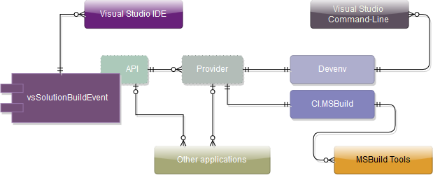

# Scheme of vsSolutionBuildEvent projects and their work

This page should describe structure of all components of the vsSolutionBuildEvent, basic scheme of work, and give an understanding of how it works with Visual Studio Command-Line & MSBuild tools.

## Basic scheme for versions v0.11+

Where:

### vsSolutionBuildEvent

The [vsSolutionBuildEvent](https://visualstudiogallery.msdn.microsoft.com/0d1dbfd7-ed8a-40af-ae39-281bfeca2334/) - is the main plugin as a [VSPackage](https://msdn.microsoft.com/en-us/library/bb166424.aspx). Contains main logic for work with events of Visual Studio through [Microsoft.VisualStudio.Shell.Interop](http://stackoverflow.com/a/18311007).

* Implements basic model of events with IVsSolutionEvents and IVsUpdateSolutionEvents2
* Works with [priority processing](http://stackoverflow.com/q/27018762) (i.e. with 'Advise..' methods instead of simple subscription with Events from DTE). See [MSDN](https://msdn.microsoft.com/en-us/library/Microsoft.VisualStudio.Shell.Interop.aspx) for more details.
* Distributed as **.vsix** for IDE Visual Studio.

### API

The [vsSolutionBuildEvent API](../API/) - is the API level for work with main library. In general, the vsSolutionBuildEvent implements the [Bridge specifications](../API/) and allows access for most features for any other applications such as the [CI.MSBuild](../CI/CI.MSBuild/), [Devenv](../CI/Devenv Command-Line/) etc.

### Provider

The [vsSolutionBuildEvent Provider](../API/) - is also as a part of API level, however this unit is intended for a quick standard work with main library. Contains loader etc.

* Used for [CI.MSBuild](../CI/CI.MSBuild/) and [Devenv](../CI/Devenv Command-Line/) projects.

### client.vssbe.dll

The `client.vssbe.dll` it's optional variant for work with events from our core library. [How to create and use](../API/#create-client-vssbe-dll).

### Devenv

The [vsSolutionBuildEvent Devenv Command-Line](../CI/Devenv Command-Line/) - is a wrapper and translator of the model of events for main library to support the command-line of Visual Studio. 

**Why is so strange ?**

[VSPackage](https://msdn.microsoft.com/en-us/library/bb166424.aspx) not allows any accessing to [Command line](https://msdn.microsoft.com/en-us/library/vstudio/xee0c8y7.aspx)(devenv.exe /devenv.com). This problem also reported [here](https://connect.microsoft.com/VisualStudio/feedback/details/1075033)

However! we can play with command-Line in [Add-Ins](https://msdn.microsoft.com/en-us/library/ms228754.aspx)... well, this component should resolve main problem above. Details of main idea [here](https://bitbucket.org/3F/vssolutionbuildevent/issue/25/does-this-work-for-command-line-builds-as#comment-14586721)

*You can see our sources if you want to reproduce this trick for your any other plugin. Also see our documentation in links above.*

### CI.MSBuild

* [vsSolutionBuildEvent CI.MSBuild](../CI/CI.MSBuild/) - is a more powerful and flexible tool in comparison with [Devenv](../CI/Devenv Command-Line/). Because this works with the Microsoft Build Tools.

It also a wrapper but a little harder.. For work with basic model of events the Visual Studio need a some converting/adaptation of all available units for our main library. Therefore, we should convert this for translations to main library.

*This is not Add-Ins and this not require any additional installation for any your environments. Simply configure and use this as stated in the [documentation](../CI/CI.MSBuild/). You can also see real sample of work on our project [here](https://ci.appveyor.com/project/3Fs/vssolutionbuildevent/build/build-31)*

#### Full version with standard libraries - vsSBE.CI.MSBuild

CI.MSBuild also works through [Provider](../API/) and also requires main library. All this can be selected and configured manually, but you can also use full version with standard libraries - [vsSBE.CI.MSBuild](https://www.nuget.org/packages/vsSBE.CI.MSBuild/) - [just get and use](../CI/CI.MSBuild/)...

### Other Applications

All this above can be used in some other your tools through [API/Provider](../API/) and similar. You can, for example, use a custom model of events for additional build and/or provide additional GUI for settings/commands/scripts and many others...

# Model of events

In general, the vsSolutionBuildEvent works on the event model, i.e.:

* There is an unified event (from Visual Studio, MSBuild tools, etc.)
* And there is any actions, that to be executed...

Basic work is a:

* Choose Event type.
* Create and configure any actions for this event above.
* Enjoy.

# Have a questions ?

Ask [here](https://bitbucket.org/3F/vssolutionbuildevent/issues/new)

# References

* [API](../API/)
* [Continuous Integration (CI)](../CI/)
* [Developer Zone](../Dev/)
* [Scripts & Commands](../Scripts/)
* [Examples](../Examples/)
